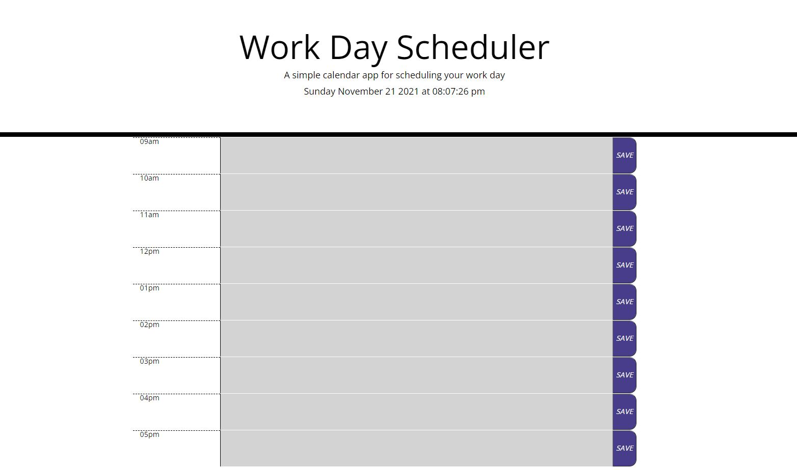
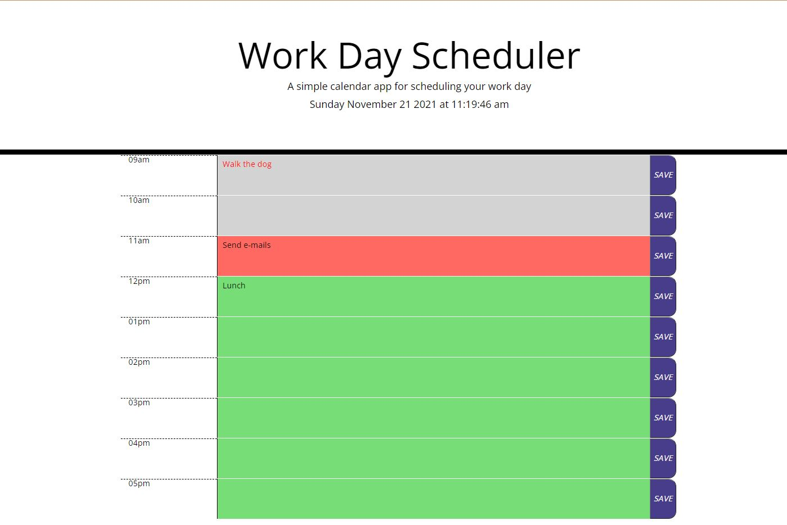

# WORKDAY PLANNER
Vienna Borowska - University of Manchester Coding Bootcamp - vienna.borowska@hotmail.com

# DEPLOYED URL
https://viennaborowska.github.io/Day-Planner/

# LANGUAGE
HTML, CSS & JavaScript

# APIs
JQuery - Bootstrap - Moment

# DESCRIPTION
## This site uses HTML, CSS and JavaScript to build a workday planner. This site uses the Moment API library and LocalStorage to remember daily tasks and track the time.

## Users are presented with the current date and time, a blank 8-hour planner and save buttons for each hour segment. Hours are colour coded for past, present and future:

  

## The coloured text area can be edited by the user and saved to Local Storage for future use:

 

## FILES
* README.md - contact information, file information
* index.html - HTML code
* style.css - CSS stylesheet
* script.js - JavaScript file
* Screenshots - expected behaviour screenshots for README

